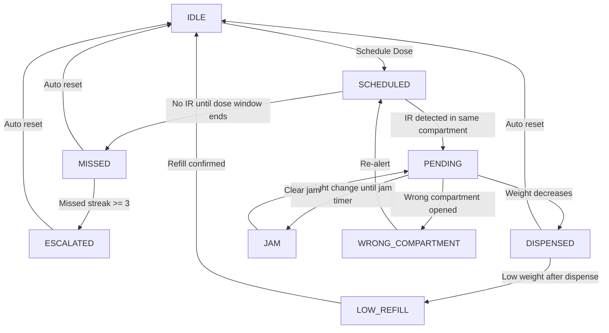

# Smart Pill Dispenser (IOT)

A simulated multi-compartment pill dispenser with:
- A Node.js WebSocket backend for state machine + alerts
- A React dashboard for live monitoring and caregiver actions
- SQLite persistence for event logs and unresolved alerts

## Tech Stack

- Backend: Node.js, ws, better-sqlite3
- Frontend: React (CRA), Recharts
- Storage: SQLite (`server/dispenser.db`)
- Transport: WebSocket (`ws://localhost:8080`)

## Project Structure

```text
IOT/
  dashboard/   # React UI
  server/      # WebSocket server + state machine + DB
```

## Quick Start

### 1) Install dependencies

```bash
cd server
npm install

cd ../dashboard
npm install
```

### 2) Run backend

From workspace root:

```bash
node server/server.js
```

Expected output:

```text
WebSocket server running on ws://localhost:8080
```

### 3) Run frontend

In a new terminal:

```bash
cd dashboard
npm start
```

Open `http://localhost:3000`.

## Core Features

- 7 compartments (`A` to `G`) with independent state machines
- Live weight + state ticks every second
- Alert queue with ACK and Snooze
- Simulation controls:
- `Schedule dose`
- `Simulate IR`
- `Set weight` (baseline set only)
- `Simulate pill taken` (user-defined grams)
- `Clear jam`

## State Flow Diagram



## Alert Behavior

### Snooze

- Default snooze duration: `300000 ms` (5 minutes)
- After timeout, alert returns only if still unresolved
- Snooze/ACK target a specific alert instance using:
- `seqId + compartment + alert timestamp`

### 3 Misses

- On each missed dose, `missedStreak` increments
- At `missedStreak >= 3`, `DOSE_ESCALATED` is emitted
- `missedStreak` resets to `0` only after successful dispense

## Simulation Scenarios

### Happy path (dispense)

1. Select compartment
2. Click `Schedule dose`
3. Click `Simulate IR`
4. Enter grams in `Take g` and click `Simulate pill taken`
5. Expect `DOSE_DISPENSED` then return to `IDLE`

### Missed dose

1. Click `Schedule dose`
2. Do not click `Simulate IR`
3. Wait for dose window (~30s)
4. Expect `DOSE_MISSED`

### Jam

1. Click `Schedule dose`
2. Click `Simulate IR`
3. Do not change weight
4. Wait for jam window (~30s)
5. Expect `PILL_JAM`

## Troubleshooting

### Port 8080 already in use

```powershell
$pid = (Get-NetTCPConnection -LocalPort 8080 -State Listen).OwningProcess
Stop-Process -Id $pid -Force
node server/server.js
```

### Dashboard not reflecting latest code

- Ensure only one backend instance is running on `8080`
- Restart backend and frontend after major logic changes

## Notes

- This project currently simulates sensors in software.
- `DOSE_ESCALATED` is persisted and shown as danger alert; external escalation actions (SMS/call/webhook) are not yet implemented.
